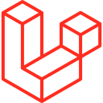
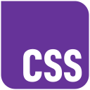
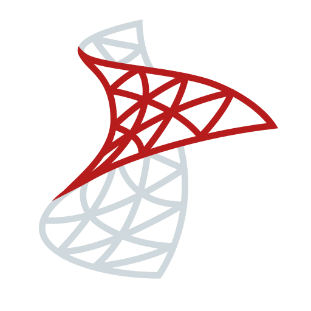
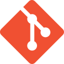

  

<h1 align="center">Aidin Ghazagh</h1>

  <b>IT/Software/Web Developer — Fullstack</b> 
  <i>Computer Engineering Graduate</i>

  <a href="https://github.com/aidinghazagh" target="_blank" rel="noreferrer">
    <picture>
      <source media="(prefers-color-scheme: dark)" srcset="assets/icons/socials/github-dark.svg" />
      <source media="(prefers-color-scheme: light)" srcset="assets/icons/socials/github.svg" />
      
    </picture>
  </a>&nbsp;
  <a href="https://www.linkedin.com/in/aidin-ghazagh" target="_blank" rel="noreferrer">
    <picture>
      <source media="(prefers-color-scheme: dark)" srcset="assets/icons/socials/linkedin-dark.svg" />
      <source media="(prefers-color-scheme: light)" srcset="assets/icons/socials/linkedin.svg" />
      
    </picture>
  </a>&nbsp;
  <a href="https://www.instagram.com/aidinghazagh" target="_blank" rel="noreferrer">
    <picture>
      <source media="(prefers-color-scheme: dark)" srcset="assets/icons/socials/instagram-dark.svg" />
      <source media="(prefers-color-scheme: light)" srcset="assets/icons/socials/instagram.svg" />
      
    </picture>
  </a>&nbsp;
  

---

### About Me

Currently working at **Altyn Logistics** as an IT/Software/Web Developer, building fullstack web applications with Laravel and managing the company's social media presence.

- Based in Iran, Golestan, Gorgan
- Passionate about building clean, efficient web and mobile applications
- Love working out, hiking, singing, guitar, video games, chess & sim racing

---

### Tech Stack

**Backend**

  &nbsp;
  &nbsp;
  &nbsp;
  &nbsp;
  &nbsp;
  

**Frontend**

  &nbsp;
  &nbsp;
  &nbsp;
  

**Mobile**

  &nbsp;
  &nbsp;
  

**Databases**

  &nbsp;
  

**Tools & Design**

  &nbsp;
  &nbsp;
  &nbsp;
  

---

### Connect

  <a href="https://www.github.com/aidinghazagh" target="_blank" rel="noreferrer">
    <picture>
      <source media="(prefers-color-scheme: dark)" srcset="assets/icons/socials/github-dark.svg" />
      <source media="(prefers-color-scheme: light)" srcset="assets/icons/socials/github.svg" />
      
    </picture>
  </a>&nbsp;&nbsp;
  <a href="https://www.linkedin.com/in/aidin-ghazagh" target="_blank" rel="noreferrer">
    <picture>
      <source media="(prefers-color-scheme: dark)" srcset="assets/icons/socials/linkedin-dark.svg" />
      <source media="(prefers-color-scheme: light)" srcset="assets/icons/socials/linkedin.svg" />
      
    </picture>
  </a>&nbsp;&nbsp;
  <a href="https://www.instagram.com/aidinghazagh" target="_blank" rel="noreferrer">
    <picture>
      <source media="(prefers-color-scheme: dark)" srcset="assets/icons/socials/instagram-dark.svg" />
      <source media="(prefers-color-scheme: light)" srcset="assets/icons/socials/instagram.svg" />
      
    </picture>
  </a>

