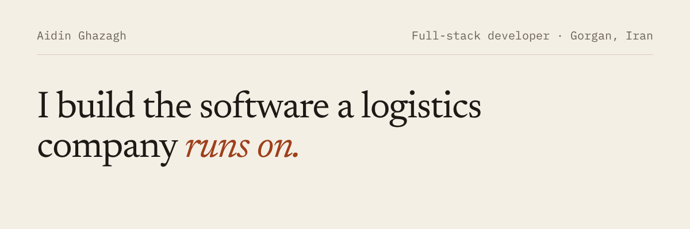

<a href="https://aidinghazagh.ir">
  <picture>
    <source media="(prefers-color-scheme: dark)" srcset="assets/images/readme-dark.png">
    
  </picture>
</a>

Full-stack developer at **Altyn Logistics** in Gorgan, Iran. Mostly Laravel and MySQL; .NET, Flutter and Kotlin when the job calls for it. Starting a Master's in Computer Engineering (Software) this year.

**[aidinghazagh.ir](https://aidinghazagh.ir)** · [Résumé](assets/Aidin-Ghazagh-Resume.pdf) · [LinkedIn](https://www.linkedin.com/in/aidin-ghazagh) · [aidinghazagh@aidinghazagh.ir](mailto:aidinghazagh@aidinghazagh.ir) · [فارسی](https://aidinghazagh.ir/fa/)

### Things I've built

**[Shop Manager](https://github.com/aidinghazagh/shopmanager-backend)** — a Laravel API and [Flutter app](https://github.com/aidinghazagh/shopmanager-frontend) for running a small shop. Each order keeps a snapshot of the product's price at the time of sale, so old orders and profit figures don't shift when prices do; API errors come back in English or Farsi.

**[Exercise dataset, in Farsi](https://github.com/aidinghazagh/exercises-dataset-farsi)** — 1,324 gym exercises translated into Farsi with a batched, resumable LLM pipeline. [Browse it →](https://aidinghazagh.github.io/exercises-dataset-farsi/)

**[CommitScope](https://github.com/aidinghazagh/github-timeline)** — any GitHub profile as a timeline, in React and TypeScript. Full history comes from GraphQL, fetched a year at a time because that's GitHub's limit. [Try it →](https://aidinghazagh.github.io/github-timeline/)

**[pingeR](https://github.com/aidinghazagh/pingeR)** and **[musicvisu](https://github.com/aidinghazagh/musicvisu)** — two small R packages: one logs pings and reports packet loss and p95/p99 latency, the other turns audio frequencies and lyrics into charts.

### Now

- Building web apps and internal tools at Altyn Logistics
- Starting my Master's in Gorgan
- Off the clock: running, chess, sim racing

### Toolbox

- **Every day:** PHP & Laravel, MySQL, JavaScript, Git
- **At work:** C# & .NET, SQL Server, Flutter & Dart, Kotlin
- **On the side:** TypeScript & React, Electron, Python, R

**به فارسی:** توسعه‌دهندهٔ فول‌استک در آلتن لجستیک، گرگان. بیشتر با لاراول و MySQL کار می‌کنم و به‌زودی کارشناسی ارشد مهندسی نرم‌افزار را شروع می‌کنم. [نسخهٔ فارسی سایت ←](https://aidinghazagh.ir/fa/)

