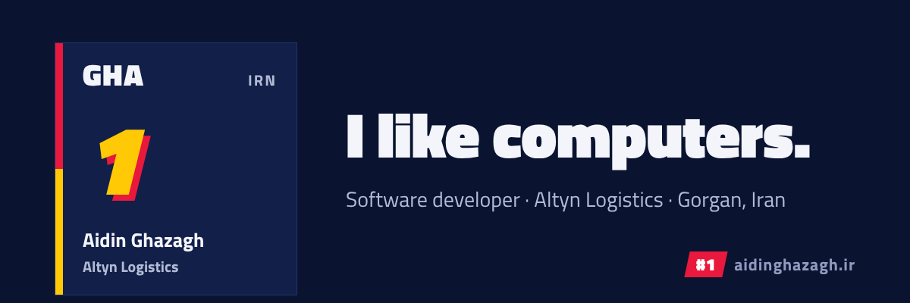

I like computers.

Software developer at **Altyn Logistics** in Gorgan, Iran. Laravel and MySQL most days, plus .NET, Flutter and Kotlin when the job needs them. Starting a master's in software engineering this year.

**[aidinghazagh.ir](https://aidinghazagh.ir)** · [Résumé](assets/Aidin-Ghazagh-Resume.pdf) · [LinkedIn](https://www.linkedin.com/in/aidin-ghazagh) · [aidinghazagh@aidinghazagh.ir](mailto:aidinghazagh@aidinghazagh.ir) · [فارسی](https://aidinghazagh.ir/fa/)

### Classification

| Pos | Project | What it is |
|:---:|---|---|
| 1 | **[Shop Manager](https://github.com/aidinghazagh/shopmanager-backend)** | Laravel API and [Flutter app](https://github.com/aidinghazagh/shopmanager-frontend) for small shops. Orders keep the price each product sold at, so old profit figures never move. |
| 2 | **[Exercises, in Farsi](https://github.com/aidinghazagh/exercises-dataset-farsi)** | 1,324 gym exercises translated to Farsi by a batch pipeline that survives dropped connections. [Browse it](https://aidinghazagh.github.io/exercises-dataset-farsi/) |
| 3 | **[CommitScope](https://github.com/aidinghazagh/github-timeline)** | Any GitHub profile as a timeline, in React and TypeScript. [Try it](https://aidinghazagh.github.io/github-timeline/) |
| 4 | **[pingeR](https://github.com/aidinghazagh/pingeR)** | R package that logs pings and reports packet loss and p95/p99 latency. |
| 5 | **[musicvisu](https://github.com/aidinghazagh/musicvisu)** | R package that turns audio frequencies and lyrics into charts. |

### Setup sheet

- **Every day:** PHP & Laravel, MySQL, JavaScript, Git
- **At work:** C# & .NET, SQL Server, Flutter & Dart, Kotlin
- **Side projects:** TypeScript & React, Electron, Python, R

Off track: sim racing, chess, running, hiking, guitar.

**به فارسی:** کامپیوتر دوست دارم. توسعه‌دهندهٔ نرم‌افزار در آلتن لجستیک، گرگان؛ بیشتر با لاراول و MySQL کار می‌کنم و امسال کارشناسی ارشد مهندسی نرم‌افزار را شروع می‌کنم. [نسخهٔ فارسی سایت](https://aidinghazagh.ir/fa/)

